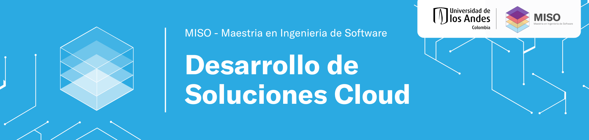

# Desarrollo de Soluciones Cloud - Grupo 13

Este repositorio es el espacio de trabajo del **Grupo 13** para el proyecto del curso **Desarrollo de Soluciones Cloud (MISW4204)**.
## Integrantes

| Nombre | Correo |
|--------|--------|
| Andrés Julián Bolívar Castañeda | a.bolivarc@uniandes.edu.co |
| Juan Diego Rodríguez Barragán | jd.rodriguezb12@uniandes.edu.co |
| Alejandro Hoyos Mogollón | a.hoyosm@uniandes.edu.co |
| Juan Pablo Reyes Romero | jp.reyesr1@uniandes.edu.co |

---

## Configuración y despliegue del proyecto

Para desplegar correctamente el proyecto, se debe leer primero la documentación de configuración y despliegue disponible en la wiki:

- [Configuración y despliegue del proyecto](https://github.com/Desarrollo-de-Soluciones-Cloud/202612-MISW4204-Grupo13/wiki/Configuraci%C3%B3n-y-despliegue-del-proyecto)

## Documentación del proyecto

La documentación general del proyecto se encuentra disponible en la wiki:

- [Wiki del proyecto](https://github.com/Desarrollo-de-Soluciones-Cloud/202612-MISW4204-Grupo13/wiki)
